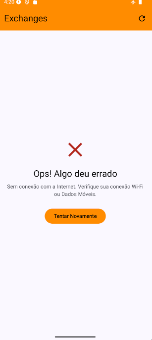
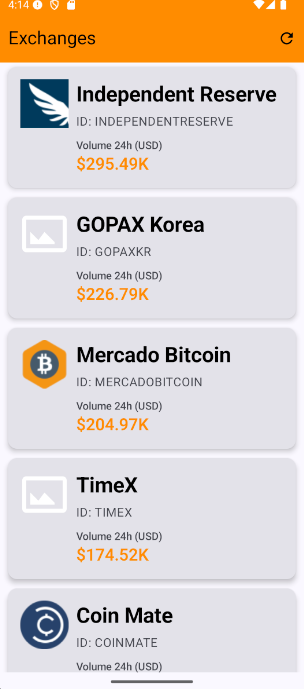

# Desafio Técnico Mobile Android

## Instruções
Criar um aplicativo para consultar a API coinapi.io e trazer as exchanges em forma de lista.
Features
- Tela de listagem: Exibir, pelo menos, os campos: name, exchange_id e volume_1day_usd. Ao tocar em um item deve ser exibida a tela de detalhes.
- Tela de detalhe: Exibe os detalhes da exchange.
  
**Observação:** trocar o texto SUA_API_KEY_AQUI por sua API KEY

## Telas

  
  
  
  
  

## Estrutura do projeto e Arquitetura
O padrão arquitetural adotado é MVVM com Clean Architecture. Dentre os benefícios desta estrutura podemos citar reuso de código, separação de responsabilidades, testabilidade, performance em builds e escalabilidade.
O projeto foi modularizado em 3 módulos principais:
- app: responsável pela navegação entre as telas, temas, configurações, inicialização de injeção de dependëncia e setup
- core: contém 6 submódulos, responsáveis por criar estruturas e utilitários que serão usados pelas features.
  - common: utilitários como funções de formatação
  - database: abstração do banco de dados local
  - network: canal de comunição com a rede
  - presentation: componentes de UI e estado de tela
  - service: centralizar a comunicação entre serviços como APIs, Firebase, Analytics, Crashlytics, Notifications
  - tests: bibliotecas de testes centralizadas, fakes, helpers de teste
- features: funcionalidades do sistema
  - exchanges: estrutura para a feature de Exchanges

### Principais componentes e bibliotecas
- Coil: Exibição e tratamento de imagens
- Compose: Criação das interfaces via código
- DataStore: Armazena informação de acesso das APIs
- Detekt e Lint: Linters para análise estática de código
- Flow: Fluxo reativo e assíncrono dos dados
- Koin: Injeção de dependência para melhorar a testabilidade e desacoplamento
- Kover: Cobertura de testes no lugar do Jacoco
- KSP: Processamento do código Kotlin mais eficiente e rápido
- Leak Canary: Detecção de vazamento de memória em tempo de execução
- Lifecycle: Controle de gerenciamento do ciclo de vida
- Material: Aproveitamento de componentes
- Navigation: Navegação entre as telas
- Okhttp: Registro de interceptadores para as requests de API 
- Owasp: Detecção de dependências vulneráveis
- Paging: Facilitar a paginação da lista
- Retrofit: Comunicação com as APIs
- Room: ORM para facilitar a persistência e consulta dos dados
- Testes: MockK, JUnit 4 e 5, Espresso, Roboletric

## O que foi feito
- Tela de Splash
- Tela genérica para erro
- Tela genérica para carregamento
- Tela de lista das exchanges com paginação e botão de atualizar lista
- Tela de detalhes da exchange
- Abreviação dos valores monetários
- Lógica para formatação de datas
- Animação de transição entre as telas
- Abrir link do site das exchanges no Chrome Custom Tabs
- Integração de detekt e lint para análise estática do código
- Checagem de vulnerabilidades
- Persistência dos dados em banco de dados para cache, redução de consumo de rede, experiência offline e performance
- Interceptadores para registro de logs, checagem de rede e manipulação do cabeçalho das requisições
- Injeção de dependência de ponta a ponta
- Representação dos estados de UI (Loading, Success e Error)
- Otimização de compilação e build do projeto
- Modularização da aplicação em multi mõdulos
- Chamada da API de exchanges somente quando houver a expiração do cache de 10 minutos
- Mapeamentos entre os objetos de entidade, dto e de domínio
- Implementação de Use Cases para buscar dados na API, dados paginados no banco de dados e detalhes de uma exchange
- ViewModels para separar lógica da UI, expor dados observáveis e gerenciar tarefas assíncronas
- Repository para encapsular os detalhes de como e onde os dados são obtidos
- Service para abstrair a API
- Separação de ambientes
- Testes unitários e de interface

## Próximos passos
- Criar backend para fazer as requisições por autenticação com token por JWT e OAuth2 nas APIs, assim não precisa expor a chave da API também e criaria um sistema mais seguro e resiliente com fallbacks e circuite break
- Criar solução para aceitar APIs de exchange de outros fornecedores para ter contingência
- Login no aplicativo por senha e/ou finger print
- Filtro de busca na tela de listagem: Autocomplete e busca por comando de voz
- Grãfico e histórico para mostrar a evolução das exchanges
- Refatoração de código e telas
- Integração com Firebase Crashlytics
- Integração com Analytics
- Integração com SonarQube
- Adicionar strings em resources
- Observabilidade com Datadog
- Aplicar acessibilidade nas telas
- Criar regras de ofuscação no Proguard
- Criar arquivo de esteira do git
- Aplicar relatório de cobertura de testes com Kover ou Jacoco
- Transformar multi módulos para multi repositórios para baixar como dependëncias
- Terminar testes unitários
- Terminar testes de interface
